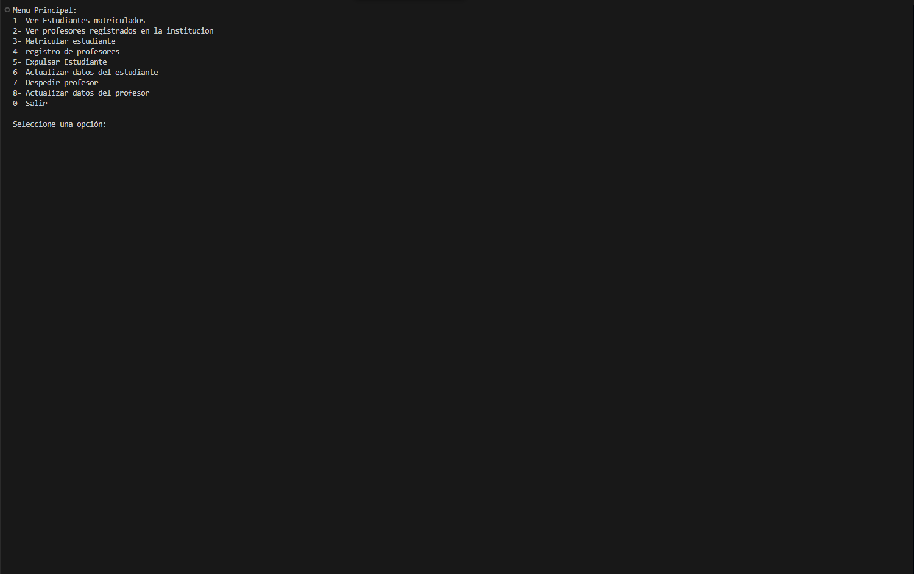
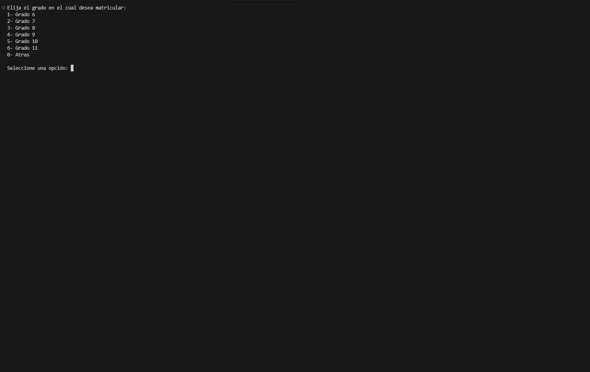
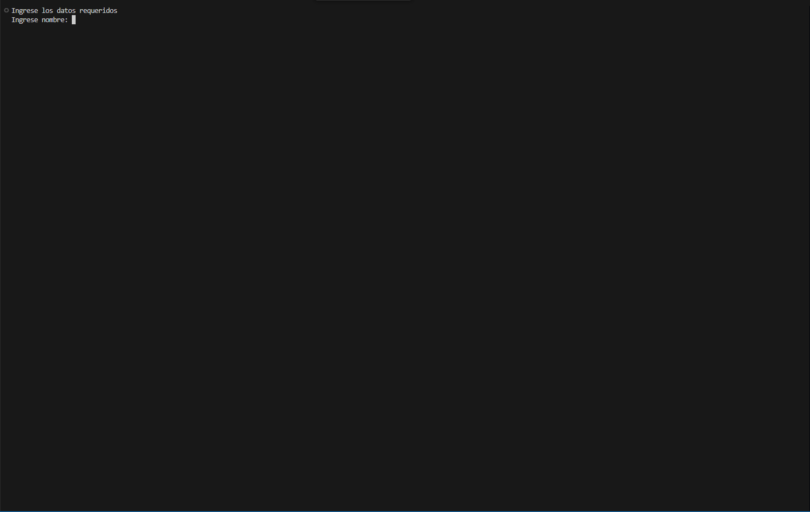

# TecnoClass

Sistema de gestión académica para el control de notas, asistencia y procesos educativos.

## Descripción

**TecnoClass** es una aplicación de escritorio desarrollada en Python que automatiza la administración escolar en instituciones educativas. El sistema permite:

- **Gestión de Notas:** Registro, cálculo de promedios y generación de reportes de rendimiento académico.
- **Control de Asistencia:** Seguimiento detallado de la presencia de los estudiantes en el aula.
- **Gestión de Estudiantes:** Almacenamiento y actualización de datos personales y académicos.
- **Optimización Administrativa:** Reemplaza procesos manuales para mejorar la comunicación docente-alumno y la organización institucional.

## Tecnologías utilizadas

- **Lenguaje:** Python.
- **Interfaz Gráfica:** Tkinter.
- **Base de Datos:** SQLite (para la persistencia de información local).

## 🚀 Descargar y probar
Puedes descargar la última versión del ejecutable desde [Releases](https://github.com/camilo19p/TecnoClass/releases)

## 📸 Capturas del sistema

| Menú principal | Selección de grado | Ingreso de datos |
|----------------|-------------------|------------------|
|  |  |  |
