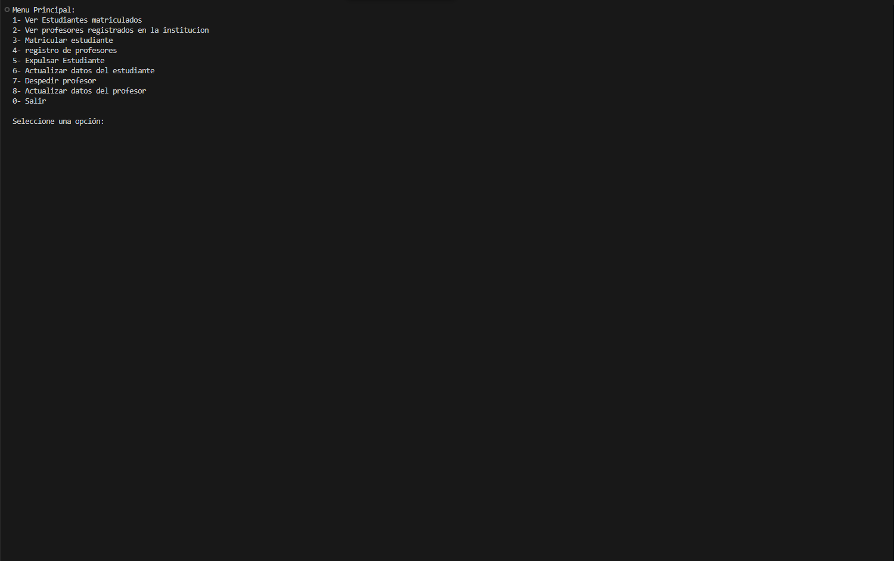
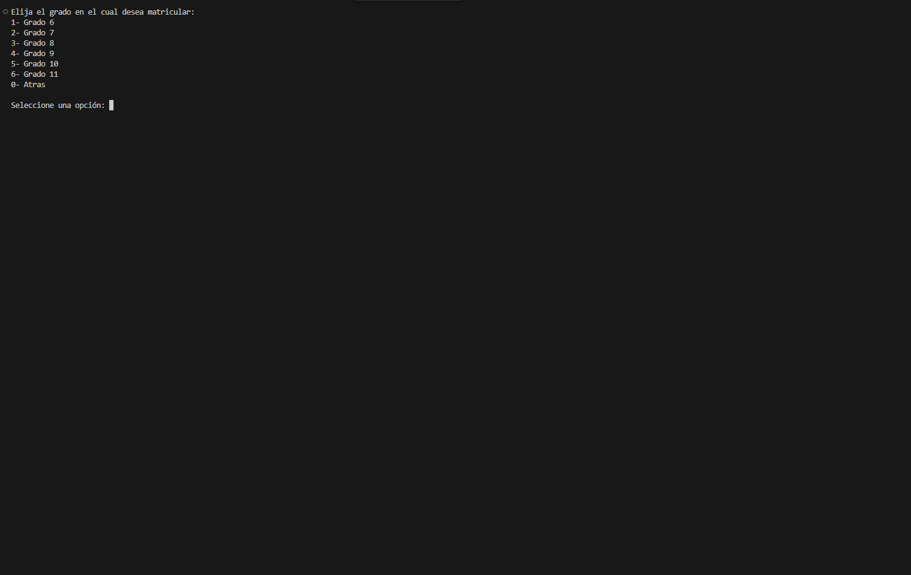
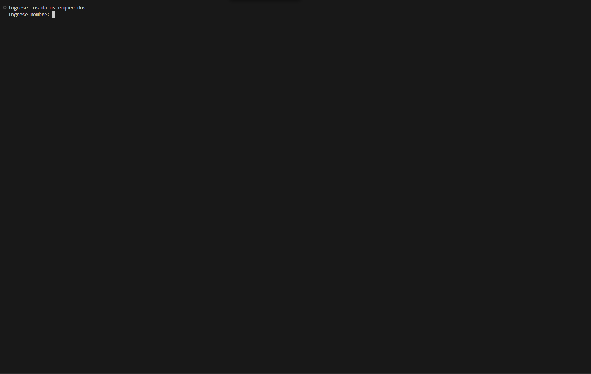

# TecnoClass - Sistema de Gestión Académica

[](https://www.python.org/)
[](https://docs.python.org/3/library/tkinter.html)
[](https://github.com/camilo19p/TecnoClass/releases)

## 📋 Descripción

**TecnoClass** es una aplicación de escritorio desarrollada en **Python** que automatiza la administración escolar en instituciones educativas. El sistema permite gestionar de forma eficiente estudiantes, profesores, notas y asistencia, reemplazando procesos manuales por una solución digital práctica y accesible.

**Proyecto desarrollado por:**
- Camilo Andrés Martínez Peña  
- Emmanuel Morillo Pájaro  
- Daniel Alfonso Magdaniels Jiménez  
- Jonathan Andrés Marimon Guerrero  
- Juan Esteban Castro Jiménez  

---

## ✨ Características principales

- **Gestión de Estudiantes**: Matricular, expulsar, actualizar y visualizar datos  
- **Gestión de Profesores**: Registrar, despedir, actualizar y visualizar datos  
- **Control de Grados**: Organización por grados (6° a 11°)  
- **Registro de Notas y Asistencia** por estudiante y materia  
- **Interfaz por consola**: Menús interactivos fáciles de usar  
- **Persistencia de datos**: Almacenamiento seguro en archivos JSON  

---

## 🛠️ Tecnologías utilizadas

- **Lenguaje**: Python 3.8+  
- **Interfaz**: Consola (principal) / Tkinter (opcional)  
- **Almacenamiento**: Archivos JSON (`estudiantes.json`, `profesores.json`, etc.)  
- **Empaquetado**: PyInstaller (para generar el ejecutable .exe)  
- **Control de versiones**: Git y GitHub  

---

## 🖼️ Capturas de pantalla

| Menú principal | Selección de grado | Ingreso de datos |
|:--------------:|:------------------:|:----------------:|
|  |  |  |

> **Nota**: Las imágenes se encuentran en la carpeta `/Capturas` del repositorio.

---

## 🚀 Cómo probar el programa

### Opción 1: Descargar el ejecutable (recomendado para usuarios sin Python)

1. Ve a la sección **[Releases](https://github.com/camilo19p/TecnoClass/releases)**  
2. Descarga el archivo `TecnoClass.exe` (la versión más reciente)  
3. Haz doble clic en el archivo para ejecutarlo  
   → ¡No necesitas instalar Python ni ninguna dependencia!

### Opción 2: Ejecutar desde el código fuente (para desarrolladores o modificaciones)

```bash
# 1. Clonar el repositorio
git clone https://github.com/camilo19p/TecnoClass.git
# 2. Entrar a la carpeta del proyecto
cd TecnoClass
# 3. Ejecutar
python main.py

📜 Licencia y Derechos de Autor
© 2023 Camilo Andrés Martínez Peña y colaboradores
Todos los derechos reservados.
Este software, su código fuente, ejecutables (.exe), documentación, capturas de pantalla y recursos asociados están protegidos por derechos de autor.
Está estrictamente prohibido (sin autorización escrita previa de los autores):

Copiar, reproducir, modificar, adaptar o crear obras derivadas
Distribuir, publicar, compartir o subir a otros repositorios/plataformas
Usar el programa (incluido el .exe) con fines comerciales, institucionales, educativos o cualquier otro
Eliminar o alterar esta nota de derechos de autor o los créditos de los desarrolladores

Cualquier uso no autorizado constituye una infracción a los derechos de autor y puede ser perseguido legalmente.
Si estás interesado en utilizar TecnoClass, obtener una licencia, colaborar o solicitar permiso, por favor contacta directamente a los autores.
Contacto: martinezcamilo25p@gmail.com
Sin una licencia explícita de código abierto, el uso, copia o distribución sin consentimiento expreso está prohibido.
